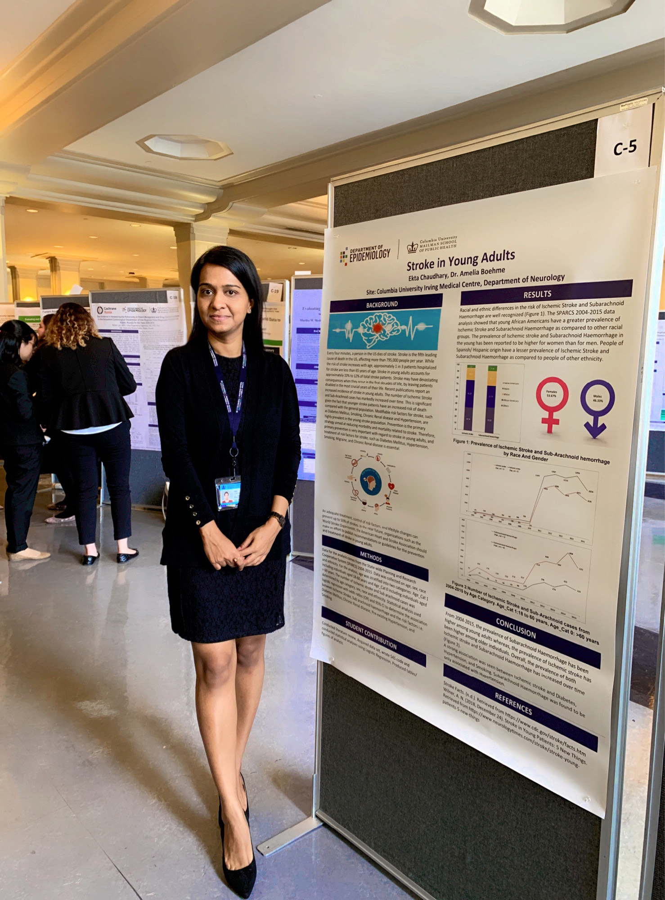

I am an **MPH-Epidemiology** candidate at **Columbia University Mailman School of Public Health** with a certificate in **Epidemiology of Chronic Diseases**. I have expertise in principles and methods of Biostatistics; principles, theories, and procedures of Epidemiology, including study design, statistical analysis, and causal inference. I have established data management/analysis competency using **SAS, R, SQL** and have experience of working with huge data sets.

**Education**

* **Columbia University Mailman School of Public Health, New York, NY**

  **Master of Public Health in Epidemiology | Certificate: Epidemiology of Chronic Diseases**                                              
  **Relevant coursework:**
  
  Epidemiology: Research Methods & Applications, Design and Conduct of Observational Epidemiology, Principles of    Epidemiology III- Applied Epidemiologic Analysis, Application of Epidemiologic Research Methods, Chronic Disease   Epidemiology, Cancer Epidemiology.

  Biostatistics: Analysis of Categorical Data, Data Science, Relational Databases And SQL Programming. 

  **Activities and Societies:** Co-President and Director of Finance- Enable (A Columbia University student  initiative to make disability stigma-free)

* **Kurukshetra University, Haryana, India**

  Bachelor of Dental Surgery Equivalent to Doctor of Dental Surgery (DDS)                                       
  
**Professional Summary**

* **New York Presbyterian Hospital, Department of Neurology** 

  **Research Assistant**  
  
  • Characterized the risk profile of young stroke patients - Determined the association of Ischemic stroke and Subarachnoid hemorrhage with the potential risk factors i.e. Diabetes Mellitus, pre-existing hypertension, Congenital heart disease, Smoking, Migraine, Patent Foramen Ovale, Chronic Renal diseases using SAS.

  • Assessed the prevalence of Stroke in young adults from 2004-2016 using the State-wide Planning and Research Cooperative System (SPARCS) dataset.

  • Assessed the prevalence of Ischemic stroke and Subarachnoid hemorrhage among adults aged 18-60 years by age category (<18 years, 18-30, 31-45, 46-60, >60 years), sex, race, and ethnicity to see the trend over time.
  
* **Columbia University Mailman School of Public Health**

  **Graduate Teaching Assistant**  
  
  •	Graduate Teaching Assistant for 2 studios- _Global and Developmental Perspectives, Integration of Science and  Practice_.
  
  • Coordinate and meet with the professor every week to review study material and lesson plans.
  
  • Evaluate and grade assignments and record grades.
  
  • Facilitate classroom discussions.
  
  • Schedule and maintain regular office hours to meet with students, respond and follow-up to student inquiries via emails. 
  
* **Dr. Ekta’s Dental Solutions, Haryana, India** 

  **Founder/ CEO/ General Dentist (Registration number: HN6274)**   
  
  •Appointed, managed and led a team of 5 Dental specialists (Orthodontist, Periodontist, Oral Implantologist, Pedodontist, Oral Surgeon), 4 Dental Auxiliary staff (Dental assistant, Dental Hygienist, Dental Mechanic, Dental technologist), 5+ Interns to ensure the effective running of the dental operatory.
  
  •Effectively conducted oral/maxillofacial and pre-prosthetic surgeries, implant surgeries, root canal treatment, scaling and root planning, smile designing, restorations on 4000+ patients.
  
  •Diagnosed oral carcinomas and performed biopsies to detect cancer at an early stage thereby prolonging life.
  
  •Performed preventive dental procedures like a topical fluoride application, pit and fissure sealant application.
  
  •Used SAS to analyze patient data to study the prevalence of dental diseases from 2014-2018 according to age, gender, socio-economic status in Panchkula, Haryana.
  
  •Maintained patient records using Relational Database- MS Access.

* **Clove Dental, Haryana, India**

  **Associate Dentist** 
  
  •	Supported with four-handed dentistry, developed and implemented individual dental care plans for 40+ patients per week, which increased productivity.
  
  •	Organized dental and medical health awareness campaigns and provided required treatment to 1000+ patients.
  
**Skills and Certifications**

* Programming: SAS, STATA, SQL, R. 

* Certifications: Columbia University Irving Medical Centre: HIPAA, CITI, Epidemiology of Chronic Diseases
  Harvard X: Data Science- R basics 

* Languages: English, Hindi, Punjabi.

