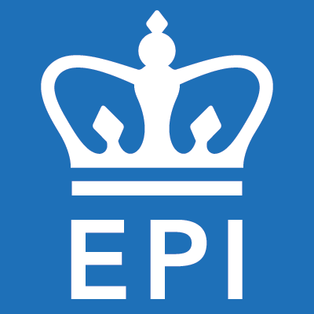

---
output: 
  html_document:
    toc: true
    toc_float: true
    
---

◆ Epidemiologist and Chronic Disease Researcher with expertise in principles and methods of Biostatistics; principles, theories, and procedures of Epidemiology, including study design, statistical analysis, and causal inference.

◆ Skilled in Data Science, Machine learning techniques, Applying classification and regression techniques beyond linear methods, Conducting exploratory data analysis using methods in unsupervised learning, Implementing various statistical learning methods, Data preprocessing, Model training, Model interpretation.

◆ In-depth understanding and application of statistical approaches including multiple regression analysis, logistic regression, generalized regression models, proportional hazards models, use of Kaplan-Meier survival analysis, spatial analysis techniques.

◆ Proficient in applying the statistical and epidemiological methodology in clinical research projects using SAS, R, SQL and interpreting the analytical results.

# Education

**Columbia University Mailman School of Public Health, New York, NY**

_Master of Public Health in Epidemiology | Certificate: Epidemiology of Chronic Diseases: Expected- May 2020_                                              
Relevant coursework:
  
_Epidemiology_: Research Methods & Applications, Design and Conduct of Observational Epidemiology, Principles of Epidemiology III- Applied Epidemiologic Analysis, Application of Epidemiologic Research Methods using SAS, Chronic Disease Epidemiology, Cancer Epidemiology

_Biostatistics_: Analysis of Categorical Data, Data Science I (R programming), Relational Databases And SQL Programming, Data Science II (Machine Learning), Applied Regression I, Applied Regression II.

_Others_: Foundation of Public Health, Global and Developmental Perspectives, Public Health Interventions, Determinants of Health, Health Systems, Leadership Development, Integration of Science and Practice, Public Health GIS

**Kurukshetra University, Haryana, India**

_Bachelor of Dental Surgery Equivalent to Doctor of Dental Surgery (DDS): Graduated- November 2012_ 

Credits completed: 145.5
Relevant coursework: 

_Year 1_: General Human Anatomy including Embryology and Histology, General Human Physiology and Biochemistry, Nutrition and Dietetics, Dental Materials

_Year 2_: Dental Anatomy, Embryology and Oral Histology, General Pathology and Microbiology, General and Dental Pharmacology and Therapeutics, Preclinical Prosthodontics and Crown & Bridge, Preclinical Conservative Dentistry

_Year 3_: General Medicine, General Surgery, Oral Pathology and Oral Microbiology, Public Health Dentistry

_Year 4_: Oral Medicine and Radiology, Pediatric and Preventive Dentistry, Orthodontics and Dentofacial Orthopedics, Periodontology, Prosthodontics and Crown and Bridge, Conservative Dentistry and Endodontics, Oral and Maxillofacial Surgery

# Work Experience

**New York Presbyterian Hospital, Department of Neurology** 

_Research Assistant (May,2019 to Present)_  
  
◆ Gathered, reviewed and summarized literature from scientific journals, such as PubMed and JAMA that identified gaps in previous research.

◆ Identified the association of Ischemic stroke and Subarachnoid hemorrhage with the potential risk factors i.e., Diabetes Mellitus, pre-existing hypertension, Congenital heart disease, Smoking, Migraine, Patent Foramen Ovale, Chronic Renal diseases by building Logistic Regression models using SAS. 

◆ Analyzed the Stroke trend in young adults from 2004-2015 by performing exploratory data analysis on SPARCS dataset using SAS.

◆ Created visualizations of the findings using R.

◆ Presented the Research findings to 50+ Researchers and 200+ graduate students at Mailman School of Public Health.

◆ Manuscript in progress.
  
**Columbia University Mailman School of Public Health**

_Graduate Teaching Assistant (August,2019 to Present)_ 
  
Graduate Teaching Assistant for 2 studios- _Global and Developmental Perspectives, Integration of Science and  Practice_.
  
◆ Facilitate classroom discussions focused on academic and intellectual topics to further students' critical thinking skills as well as an understanding of the materials presented, providing academic support to 400+ students.

◆ Track class and student metrics including attendance, projects, labs, and record grades.

**Dr. Ekta’s Dental Solutions, Haryana, India** 

_Founder/ President/ CEO/ (July 2013 to July 2018)_                                                                                                                   
◆ Appointed, managed and led a team of 5 Dental specialists (Orthodontist, Periodontist, Oral Implantologist, Pedodontist, Oral Surgeon), 4 Dental Auxiliary staff (Dental assistant, Dental Hygienist, Dental Mechanic, Dental technologist), 5+ Interns to ensure the effective running of the dental operatory.

◆ Effectively conducted oral/maxillofacial and pre-prosthetic surgeries, implant surgeries, root canal treatment, scaling and root planning, smile designing, restorations on 5000+ patients.

◆ Diagnosed oral carcinomas and performed biopsies to detect cancer at an early stage thereby prolonging life.

◆ Performed preventive dental procedures like a topical fluoride application, pit and fissure sealant application.

◆ Used SAS to analyze patient data to study the prevalence of dental diseases from 2014-2018 according to age, gender, socio-economic status in Panchkula, Haryana.

◆ Maintained patient database using MS Access and used SQL queries to pull patient database for analysis.

◆ Organized weekly free dental camps which improved the oral health of 100+ patients every week.

**Swami Devi Dayal Hospital and Dental College, Haryana, India**  

_Research Assistant (November 2011 to November 2017)_

◆ Managed, cleaned, and optimized hospital databases using MS Access.

◆ Collected relevant patient data, carefully analyzed the data using SAS to produce reports and graphs, communicated the results in a clear, concise and actionable manner.

◆ Screened potential subjects to determine suitability for studies.

◆ Managed critical paperwork such as informed consent forms and personal waivers.

_Clinical Intern (November 2011 to November 2012)_

◆	Completed the compulsory rotational paid internship that provided clinic training in all the different specialities of dentistry.

◆	Scheduled appointments, maintained records and conducted dental treatment on over 1000 patients in one year.

◆	Organized dental and medical health awareness campaigns at Indo-Tibetan Border Police, Haryana and provided required treatment to 500+ patients.

◆	Assisted with research conducted to study the Impact of mid-day meal program on educational and nutritional in rural Haryana, India.

# Skills and Certifications

◆ **Programming:** SAS, STATA, SQL, R. 

◆ **Database Management tools:** MS Access, MySQL

◆ **Data Visualisation tools:** Shiny, Plotly, ggplot2, Tableau, Flexdashboard 

◆ **Microsoft Office Suite:** MS-Word, MS-Excel, MS-PowerPoint, MS Access, MS Outlook

◆ **Certifications:** HIPAA, CITI, Epidemiology of Chronic Diseases, Data Science- R basics, Advanced SQL for Data Scientists, Tableau 10 for Data Scientist

◆ **Languages:** English, Hindi, Punjabi.

# Volunteer Leadership 

**Enable, Columbia University** 

**Founder and President** 

◆ Planned, organized and executed events to raise awareness on disability and destigmatize disability.

◆ Monitored semesterly expenses per event via keeping receipts from vendors and submitted reimbursements to the Office of Student Affairs to ensure the stable functioning of the organization.

◆ Collaborated and invited other organizations for on-campus events for community engagement.

