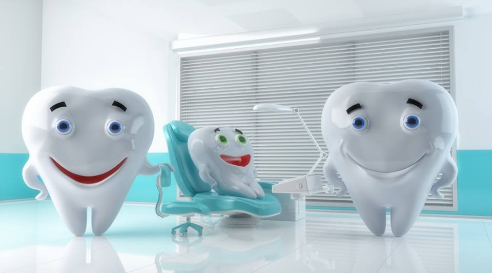

**MPH-Epidemiology** 

**Columbia University Mailman School of Public Health, New York**

**Welcome to my Website!!**

* I am a **Dental Surgeon** and an **Epidemiologist**!

* I am the Founder and co-president of [Enable](https://mailman-columbia.campuslabs.com/engage/organization/enable)

* Enable is a student organization at Columbia University Mailman School of Public Health. 

* The mission of Enable is to destigmatize disability of all forms.

* You can follow Enable on [Instagram](https://www.instagram.com/enable_at_columbia/)

