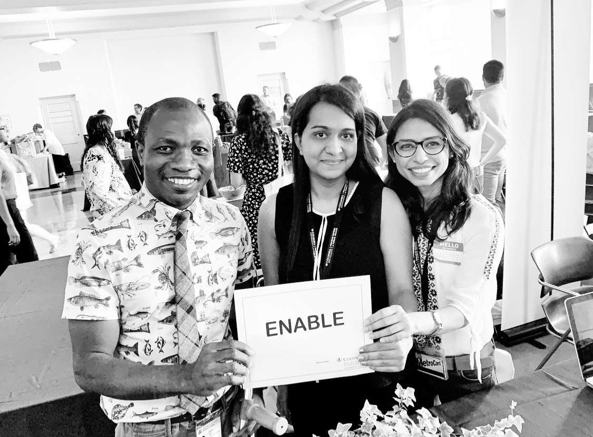

**Ekta Chaudhary**

**MPH-Epidemiology** 

**Columbia University Mailman School of Public Health, New York**

* You can learn more about my professional background and accomplishments [here](about-me.html)

* Here's a link to my [LinkedIn](https://www.linkedin.com/in/ekta-chaudhary-80469716a/) 
  and my [Github](https://github.com/Ekta1489)

* I am a **Dental Surgeon** and an **Epidemiologist**!

* I am the Founder and co-president of [Enable](https://mailman-columbia.campuslabs.com/engage/organization/enable)

* Enable is a student organization at Columbia University Mailman School of Public Health. 

* The mission of Enable is to destigmatize disability of all forms.

* You can follow Enable on [Instagram](https://www.instagram.com/enable_at_columbia/)

